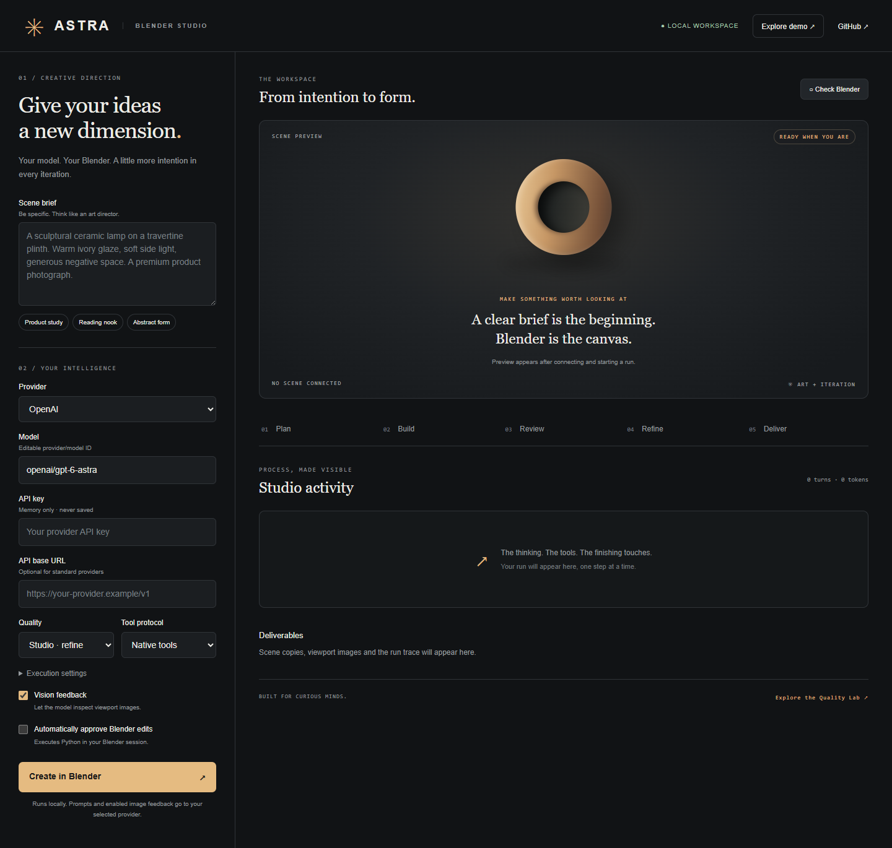

# Astra Blender Harness

[Español](README.es.md)

**Bring your model. Build in Blender. See what actually happened.**

A local studio and CLI that connects API models to [Blender MCP](https://github.com/ahujasid/blender-mcp). It discovers real tools, builds in small steps, captures viewport evidence, asks the model to critique the scene, refines it, and saves scene copies. There is no Astra account or hosted proxy. Your API key stays in memory by default; if you choose to save a setup, the key goes to your operating system keyring and never to a file.



> Early release. Tested with a real Blender 4.5.9 session and official Blender MCP 1.9.1, plus automated protocol and agent tests. Model/provider quality is not benchmarked yet. Model compatibility is not a promise that every model can produce excellent 3D.

## Start here

Requires Python 3.11+, Blender with the Blender MCP add-on running, and an API key (or a local model server). Install [uv](https://docs.astral.sh/uv/getting-started/installation/) for the default `uvx blender-mcp` transport.

```sh
git clone https://github.com/AleBrito124356/astra-blender-harness.git
cd astra-blender-harness
python -m venv .venv
# Windows: .venv\Scripts\activate
# macOS/Linux: source .venv/bin/activate
python -m pip install -e '.[keyring]'   # plain '.' also works; the key is then not remembered
astra-blender serve
```

Open **http://127.0.0.1:8765**. In Blender, enable the upstream add-on and start its MCP connection from the viewport sidebar. Close other clients using the same Blender MCP instance. In Astra, choose a model, enter your key, check the MCP connection, write a brief and create. Review each proposed Python operation, or explicitly enable automatic execution for this run.

Use **Demo** to explore the full workflow without a key or Blender. Demo evidence is a generated illustration, not a Blender render. It never contacts a provider.

## What is implemented

- Real MCP SDK client: stdio and Streamable HTTP, paginated discovery, JSON Schema validation.
- [LiteLLM](https://docs.litellm.ai/docs/providers) provider routing: OpenAI, Anthropic, Gemini, DeepSeek, OpenRouter, NVIDIA NIM, Ollama and compatible endpoints. Use any supported `provider/model` identifier.
- Model picker built from the installed LiteLLM catalog, showing tool-calling and vision support per model. A wrong identifier is caught in the form instead of failing on the first model turn.
- Live model discovery for any OpenAI-compatible provider: ask the endpoint what it serves and get identifiers already prefixed for LiteLLM. Built for gateways such as NVIDIA NIM, whose model IDs (`deepseek-ai/deepseek-v4-pro-0813`) no static catalog tracks.
- Saved setups: provider, model, API base and defaults in a local config file; the API key only in the OS keyring, never in that file. Install with the `keyring` extra to enable it.
- Native tool calls, plus a strict JSON-action mode for text models without native tool use. Malformed responses get bounded repair attempts.
- Plan → build → review → refine → finalize. Read-only planning/review, mandatory scene/viewport evidence and `.blend` checkpoints. Draft skips refinement.
- Optional visual feedback. Text-only models still receive scene information; humans can inspect saved viewport images.
- Sequential Blender operations, approval queue, cancellation, deadlines, turn/token limits and no automatic mutation retries.
- The run deadline pauses while an approval waits for you. Review time is yours, not the model's; the wait is reported separately as `awaiting_approval_seconds`.
- Every budget is editable, and a budget of `0` removes that limit: turns, tokens and wall clock alike. The per-phase caps are settings too, not hidden constants; the build phase used to get half the total turns with no way to say otherwise.
- Reloading the page no longer costs anything: the studio reattaches to the last run, replays its trace, images and files from disk, and if the run is still going it keeps polling with its approval buttons live. Past runs are served from `runs/` even after Astra restarts.
- Continue a run that stopped early. Its conversation is saved to `state.json` and the scene it built is still in Blender, so a resumed run picks up at the phase it left, re-inspects, and carries on with a fresh budget. Resumable runs are read from disk, so they survive restarting Astra.
- Live activity, viewport gallery, downloadable manifests, trace and scene files. No fabricated success status when the run fails or exhausts its budget.
- Runs saved to `./runs/<id>/`. The harness copies scenes rather than overwriting the original `.blend`.
- Resizable viewport panel with an expand mode, and a configurable capture size. Note that `max_size` only downscales: the real resolution is the size of your 3D viewport area inside Blender.

## Recommended starting models

Recommendations below are engineering starting points based on documented tool/vision capabilities, **not a Blender benchmark ranking**. Verified against official catalogs on **2026-09-09**. Access and IDs can change; edit the model field freely.

| Use | Model identifier | Why start here |
| --- | --- | --- |
| Complex scenes | `openai/gpt-6-astra` | Strong end-to-end reasoning and code; use vision for critique. |
| Balanced OpenAI option | `openai/gpt-5.6-terra` | Balance intelligence and cost; compare using the lab. |
| Agentic coding alternative | `anthropic/claude-opus-5` | Tool use, image input, complex coding. |
| Faster iteration | `anthropic/claude-sonnet-5` | Speed/intelligence tradeoff for repeated edits. |
| Low-cost experiments | `gemini/gemini-2.5-flash` | Stable multimodal baseline with function calling. |
| Local/private | `ollama_chat/<your-installed-model>` | No hosted provider needed; choose a model with tools and optionally vision. |
| Custom gateway | `openai/<gateway-model-id>` | Set the OpenAI-compatible base URL including `/v1`. |

Sources: [OpenAI model catalog](https://developers.openai.com/api/docs/models/all), [Anthropic model comparison](https://platform.claude.com/docs/en/models/overview), [Gemini catalog](https://ai.google.dev/gemini-api/docs/models), [LiteLLM providers](https://docs.litellm.ai/docs/providers).

Use **↻** beside the model list to ask your provider directly; this is the reliable route for a gateway whose identifiers are long or versioned. If a model rejects tool declarations, select **JSON actions**. If it rejects images, disable **Vision feedback**. Embedding, audio-only and image-generation-only models cannot run this harness. A custom API with an incompatible protocol needs a LiteLLM adapter; an API key alone cannot make every endpoint compatible. New model IDs may require a newer LiteLLM version. Do not infer API access from a chat subscription.

## CLI

```sh
# Set ASTRA_API_KEY in your environment (avoid placing keys in shell arguments).
astra-blender run "Create a ceramic teapot in a warm photographic studio" --model openai/gpt-6-astra --auto-approve
astra-blender run "Create an isometric reading nook" --model ollama_chat/qwen3 --api-base http://localhost:11434 --no-vision --tool-mode json --auto-approve
astra-blender doctor
```

Without `--auto-approve`, the CLI asks before mutations. A cancelled/timed-out command can still finish inside Blender; inspect Blender before retrying. Provider requests can retry transient failures once, but Blender mutations never retry automatically.

## MCP configuration

Copy `mcp.example.json` to `config.local.json` and use `astra-blender serve --config config.local.json` (also accepted by `run` and `doctor`). The default is `uvx blender-mcp==1.9.1`, with upstream safe mode enabled and upstream telemetry disabled. Pin the upstream package version after testing it in your environment. Never load configuration files from untrusted sources: they can launch programs.

For remote MCP use `transport: "http"`, an HTTPS `url`, and optional `headers` in the local configuration. Blender itself must save to a shared filesystem at the same absolute output path; remote artifact transfer is not implemented. The browser cannot change the MCP executable or expose extra tools. To allow asset integrations, explicitly add their tool names to `allowed_tools` in your local config, configure their credentials in Blender, and respect licenses and service charges.

## Quality workflow

Be specific about the subject, style, scale, camera and deliverable. Start with **Draft**, inspect the silhouette and composition, then use **Studio** for a complete review/refinement pass. **Final** uses the same bounded phases and asks for a finished render; it does not silently multiply your budget. All presets permit modest final renders, but render completion is not guaranteed. A `.blend` export and viewport evidence do not prove that `final.png` was rendered.

Get reusable scene briefs, Blender inspection scripts, material/light recipes and a transparent scoring rubric from [Blender Quality Lab](https://github.com/AleBrito124356/blender-quality-lab).

## Local trust and privacy

The UI binds to `127.0.0.1`, validates Host/Origin and uses a per-process API token. It is a single-user local app, not an internet-facing service. Keys entered in the UI are not stored in localStorage or trace files. API calls send prompts, tool outputs and (when enabled) viewport images to your chosen provider. Third-party SDK/provider logging and data policies apply. Traces and scene files contain your work: do not commit private runs.

`execute_blender_code` executes Python with Blender's permissions. Upstream safe mode and approvals reduce accidental risk; neither is an OS sandbox. Use a disposable Blender session for untrusted prompts/assets. Checkpoints are best-effort recovery copies, not transactions. Automatic approval explicitly authorizes all allowed tool operations during that run.

Token limits stop subsequent model calls after reported usage reaches the limit; the last response may overshoot. They are not a dollar cap. Set a provider-side spending limit when needed. Prompt history is retained with only the newest images, so long runs can still exhaust a model's context. The UI keeps at most 50 runs per process; restart to release memory. Files remain on disk.

## Development

```sh
python -m pip install -e '.[dev]'
python -m pytest
python -m ruff check src tests
python -m build
```

Tests do not spend API credits. To enable GitHub Actions, copy `docs/github-actions.yml` to `.github/workflows/ci.yml` and push with a credential that has workflow permission. See [validation notes](docs/validation.md) for what was actually exercised. MIT licensed. Independent project by Alejandro Brito; not affiliated with Blender, OpenAI, Anthropic, Google or the Blender MCP authors.
